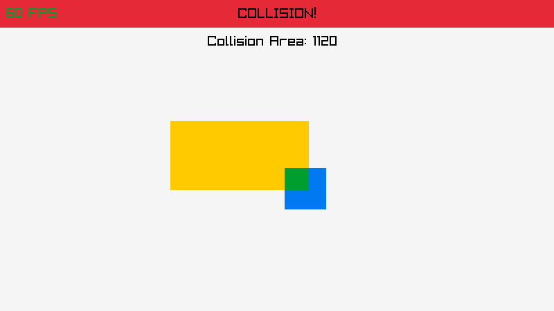
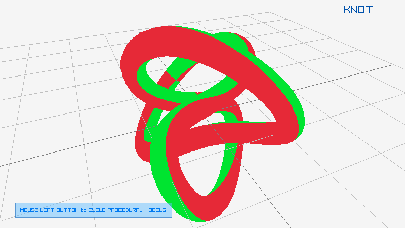

# raylib4Vita samples
raylib samples for PlayStation Vita

For compiling each sample
```
cd [sample]
make
```

## EXAMPLES LIST

### category: shapes

Examples using raylib shapes drawing functionality, provided by raylib.

| ## | example  | image  | developer  | new |
|----|----------|--------|:----------:|:---:|
| 26 | [shapes_logo_raylib](shapes/shapes_logo_raylib/source/main.c)                         |                          | ray                                        |        |
| 27 | [shapes_logo_raylib_anim](shapes/shapes_logo_raylib_anim/source/main.c)               |                | ray                                        |        |
| 30 | [shapes_collision_area](shapes/shapes_collision_area/source/main.c)                   |                    | ray                                        | ⭐️     |


### category: textures

Examples using raylib textures functionality, including image/textures loading/generation and drawing, provided by raylib 

| ## | example  | image  | developer  | new |
|----|----------|--------|:----------:|:---:|
| 40 | [textures_logo_raylib](textures/textures_logo_raylib/source/main.c)                   |                    | ray                                              |        |
| 44 | [textures_image_generation](textures/textures_image_generation/source/main.c) |  | ray                                              | ⭐️     |

### category: models

Examples using raylib models functionality, including models loading/generation and drawing

| ## | example  | image  | developer  | new |
|----|----------|--------|:----------:|:---:|
| 72 | [models_cubicmap](models/models_cubicmap/source/main.c)                               |                                | ray                                              |
| 76 | [models_mesh_generation](models/models_mesh_generation/source/main.c)                 |                  | ray                                              |        |

As always contributions are welcome, feel free to send new examples! Here it is an [examples template](template/source/main.c) to start with!
